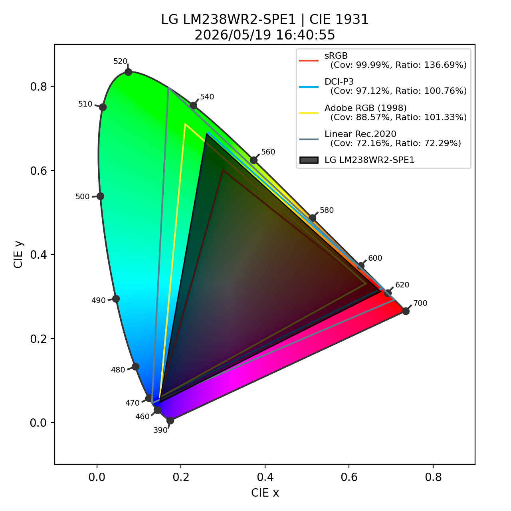
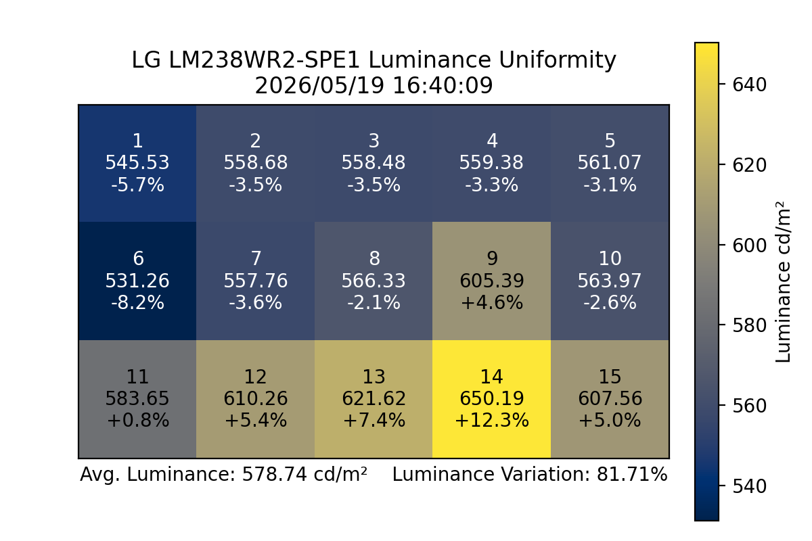
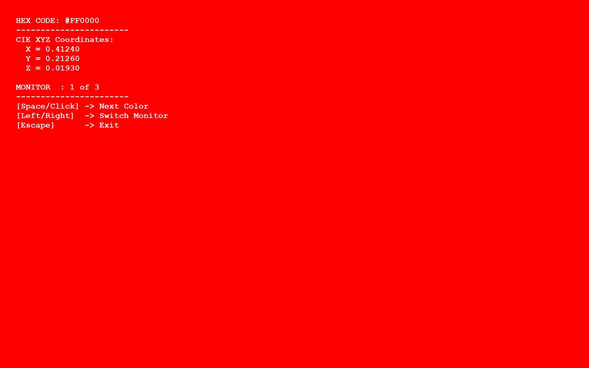

# Screen Test Scripts

A collection of Python applications for analyzing and testing display color characteristics, including color space measurement, uniformity analysis, and full-screen color display utilities.

## Programs

### 1. Screen Analysis (`screen_analysis/screen_analysis.py`)

A graphical application for analyzing display gamma measurements and color uniformity data from CSV exports.

#### Features
- **Color Space Analysis**: Plots measured display color gamut against industry standards (sRGB, DCI-P3, Adobe RGB, Rec.2020)
- **Gamut Coverage Calculation**: Computes color space coverage and area ratios relative to standard color spaces
- **Uniformity Mapping**: Visualizes luminance uniformity across 15 measurement points on the display
- **Drag & Drop Interface**: Load CSV files by clicking or dragging files directly onto buttons

#### How to Use

1. **Launch the Application**
   ```bash
   python screen_analysis/screen_analysis.py
   ```

2. **Color Space Analysis**
   - Click or drag-and-drop a `*GammaMeasData.CSV` file onto the first button
   - The file format should contain gamma measurements for red, green, and blue channels
   - Click "Calculate and Plot Color Space" to generate a chromaticity diagram
   - The plot displays the measured color gamut with coverage percentages for each standard

3. **Uniformity Analysis**
   - Click or drag-and-drop a `*Uniformity ColorMeasurement.CSV` file onto the second button
   - The file should contain 15 luminance measurements in a 5×3 grid layout
   - Click "Calculate and Map Uniformity" to generate a heatmap
   - The visualization shows absolute luminance values and percent deviation from average

#### Input File Format

**GammaMeasData.CSV**
- Rows 22-38: Red channel measurements (Tone, x, y columns)
- Rows 42-58: Green channel measurements
- Rows 62-78: Blue channel measurements
- Last row: Date and time metadata

**Uniformity ColorMeasurement.CSV**
- First 15 rows: Luminance measurements in 5×3 grid (Lv column is used)
- Last row contains date and time in the last two columns

#### Example Output


*Chromaticity diagram showing measured display gamut (black polygon) overlaid on standard color spaces*


*Luminance uniformity visualization with cell indices, values (cd/m²), and deviation percentages*

---

### 2. Color Viewer (`color_viewer/color_viewer.py`)

A full-screen color display utility for visual inspection of standardized colors and CIE XYZ measurements.

#### Features
- **Full-Screen Display**: Shows pure colors in full-screen mode on selected monitor
- **Multi-Monitor Support**: Switch between multiple monitors; press `A` to toggle an "all monitors" mode that displays the current color on every connected monitor
- **CIE XYZ Calculation**: Displays CIE XYZ coordinates for each color
- **Predefined Colors**: Displays 9 standard test colors (red, green, blue, cyan, magenta, yellow, white, gray, black)

#### How to Use

1. **Launch the Application**
   ```bash
   python color_viewer/color_viewer.py
   ```

2. **Navigation Controls**
   - **Space or Click**: Display the next color
   - **Left/Right Arrow**: Switch to previous/next monitor (disabled when in all-monitor mode)
   - **A**: Toggle all monitors mode (show the same color on every connected monitor)
   - **Escape**: Exit the application

3. **Configuration**
   Edit the `COLORS_TO_DISPLAY` list in `color_viewer.py` to customize colors:
   ```python
   COLORS_TO_DISPLAY = [
       "#FF0000",  # Red
       "#00FF00",  # Green
       "#0000FF",  # Blue
       # ... add more hex colors as needed
   ]
   ```

   Set the starting monitor with `START_MONITOR_INDEX`:
   ```python
   START_MONITOR_INDEX = 0  # Start on first monitor
   ```

#### Example Output


*Full-screen red display with CIE XYZ coordinates and navigation instructions overlaid*

---

## Requirements

### Dependencies
- Python 3.7+
- tkinter (usually included with Python)
- tkinterdnd2
- pandas
- colour-science
- matplotlib
- numpy
- shapely
- screeninfo

### Installation

1. **Create a virtual environment** (recommended):
   ```bash
   python -m venv venv
   source venv/Scripts/activate  # Windows
   # or
   source venv/bin/activate      # macOS/Linux
   ```

2. **Install dependencies**:
   ```bash
   pip install tkinterdnd2 pandas colour-science matplotlib numpy shapely screeninfo
   ```

---

## File Structure

```
Screen Test Scripts/
├── archive/                        # Legacy/previous versions
├── color_viewer/
│   ├── color_viewer.py             # Full-screen color display utility
│   ├── color_viewer.spec           # PyInstaller spec file
│   ├── color_viewer_icon.png       # Application icon
│   ├── dist/
│   │   └── color_viewer.exe        # Built executable
│   └── build/                      # PyInstaller temporary build files
├── screen_analysis/
│   ├── screen_analysis.py          # Main color analysis application
│   ├── screen_analysis.spec        # PyInstaller spec file
│   ├── screen_analysis_icon.png    # Application icon
│   ├── dist/
│   │   └── screen_analysis.exe     # Built executable
│   └── build/                      # PyInstaller temporary build files
├── examples/                       # Example output image placeholders
└── README.md                       # This file
```

---

## Executables

Standalone builds are already present in the `dist/` directories for each application:

- `color_viewer/dist/`
- `screen_analysis/dist/`

Each `dist/` folder contains the packaged executable and any support files produced by PyInstaller.

If you need to rebuild the executables, use the supplied `.spec` files:

```bash
# Rebuild screen_analysis executable
pyinstaller screen_analysis/screen_analysis.spec

# Rebuild color_viewer executable
pyinstaller color_viewer/color_viewer.spec
```

The new executables will again appear in each application's `dist/` directory.

---

## Troubleshooting

### Multi-Monitor Issues
- On Windows, the DPI awareness is automatically configured in `color_viewer.py`
- If windows don't appear on the correct monitor, check your display settings and resolution scaling

### CSV File Format Issues
- Ensure CSV files use the exact format expected by the analysis scripts
- Check that measurement data is in the correct row ranges (see Input File Format section)
- Use UTF-8 encoding when saving CSV files

### Missing Dependencies
- If you get import errors, ensure all packages are installed in your active Python environment
- Verify your Python version is 3.7 or later: `python --version`

---

## License

This project is released under the GNU General Public License v3.0 (GPL-3.0).

You are free to use, modify, and redistribute this software under the same license terms.

For full license text, see the [GNU GPL v3](https://www.gnu.org/licenses/gpl-3.0.en.html).

## Notes

- All measurements use CIE 1931 color space for chromaticity calculations
- Color space calculations are based on the `colour-science` library's standard color spaces
- Uniformity analysis assumes a 3×5 grid of measurement points
